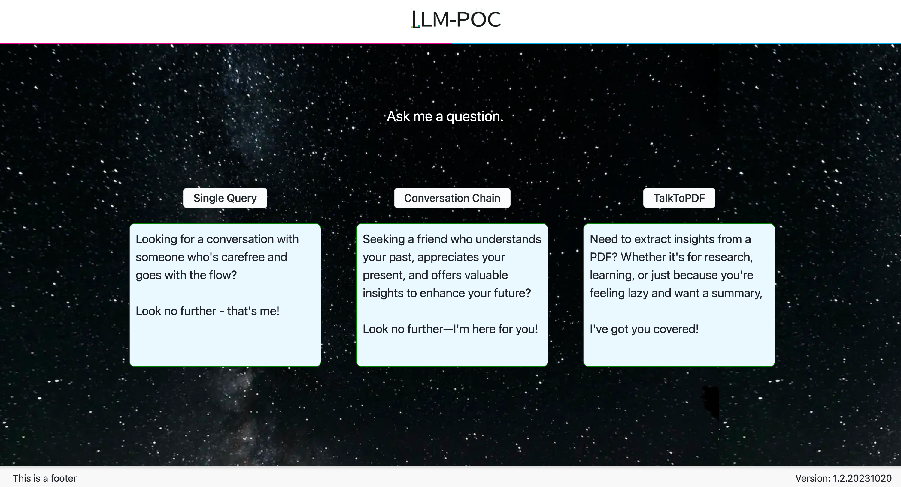
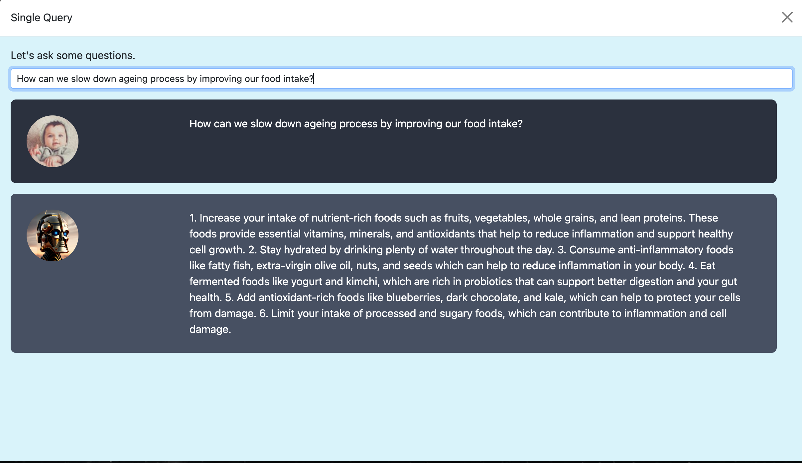
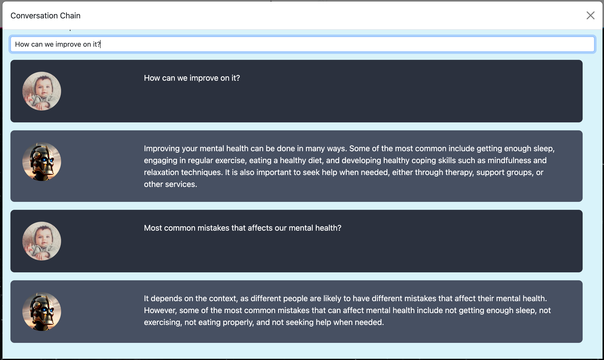
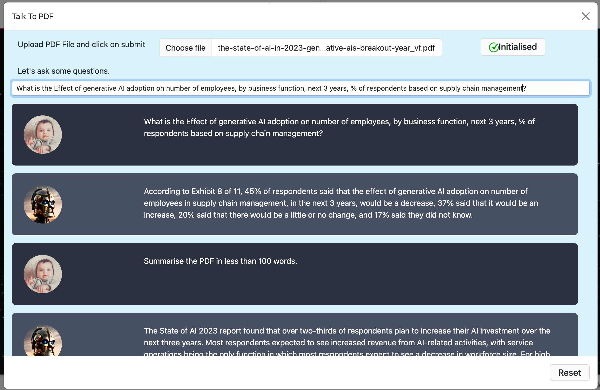

# Project Setup Instructions

Welcome to LLM Demo project! Below are the steps to set it up on your local machine after cloning the repository.

## Prerequisites:

Make sure you have a `.env` file inside the `LLM-Directory` with `OpenAI_API_KEY` as the key value.

## Setup Steps:

1. **Navigate to the Project Directory:** 
   ```sh
   cd LLM-Setup
   ```

2. **Ensure Executable Permissions for the Update Script:** 
   ```sh
   chmod +x update.sh
   ```
   This script simplifies keeping the setup current by managing submodules for both backend and frontend repositories.

3. **Execute the Update Script:** 
   ```sh
   ./update.sh
   ```
   This command switches to the specified branches and pulls the latest changes, ensuring your setup is always up-to-date.

4. **Start the Project Using Docker:** 
   ```sh
   docker-compose up -d --build
   ```
   This command containerizes the modules, streamlining the setup process for the entire project.

After successfully completing these steps, you can access the following components:

- **UI:** Accessible at [http://localhost:3000/](http://localhost:3000/)
- **Backend:** Accessible at [http://localhost:5000/](http://localhost:5000/)

## Project Features:



Our project offers three key features:

1. **Single Query:** This feature utilizes the OpenAI API to predict replies. It provides the best possible response without retaining conversation history or previous inputs.
   

2. **Conversation Chain:** The AI stores historical inputs and replies in a memory buffer. This enables easy access to past conversations by simply referencing the memory.
   

3. **Talk To PDF:** Users can upload a file and communicate with it using AI tools. This functionality leverages FAISS-cpu and the LangChain AI wrapper, enhancing user interaction with PDF files.
   

## Important Dependencies:

- **LangChain**
- **OpenAI**
- **FAISS-cpu**
- **PyPDF2**

Feel free to explore the capabilities of our project and enjoy seamless communication with AI-powered tools! If you encounter any issues or have questions, please don't hesitate to reach out. Happy coding!